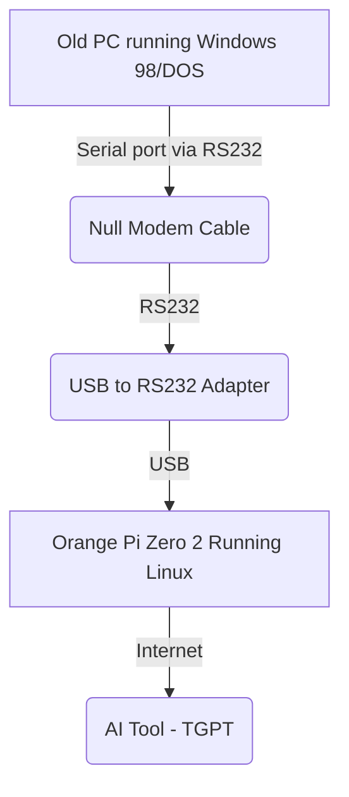

# RetroComputersWithAI
A guide to Bring the AI wisdom to retro computers

## Introduction

AI tools provides the users to have super powers in terms of wisdom.
For example, if the user does not know which are the commands to perform a partitioning to a hard disk, the AI can assist the user, provide the correct commands, plus giving explanation about all the involved steps.

The idea is to provide retrocomputers (e.g. MS-DOS, windows 98 PCs) access to a modern AI tools and some basic text web browsing experience

## Screenshots

## Main concept

It is a fact that retrocomputers have an infinite ammount of impediments to get connected to the modern digital world.

However, a single board computer, even the most simple ones with 1GB of RAM, is able to run Linux and do some basic interactions with the modern internet at console level.

The idea is to use a port that can be found in almost every retro computer
as follows:

## Ingredients

- Any modern computer, or any SBC
- tgpt https://github.com/adamyodinsky/TerminalGPT
- USB to RS232 adapter (optionally you can directly interface the SBC RS232 interface to the com port, but... I prefer the USB to RS232 adapter)
- null modulation cable *really important*
- agetty (99.99% of the time is included with any linux distro)
