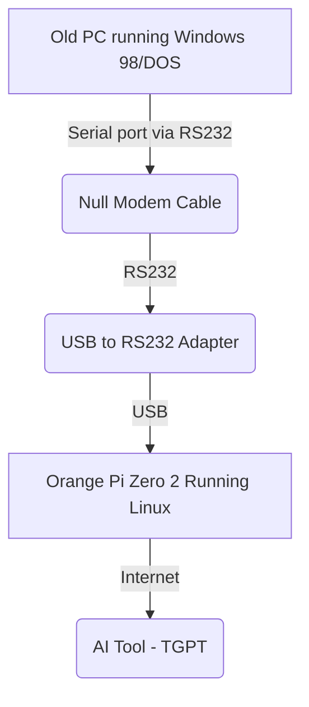

# RetroComputersWithAI
A guide to Bring the AI wisdom to retro computers

## Introduction

AI tools provides the users to have super powers in terms of wisdom.
For example, if the user does not know which are the commands to perform a partitioning to a hard disk, the AI can assist the user, provide the correct commands, plus giving explanation about all the involved steps.

The idea is to provide retro-computers (e.g. MS-DOS, windows 98 PCs) access to a modern AI tools and some basic text web browsing experience

## Screenshots from my win98 laptop

## Main concept

It is a fact that retrocomputers have an infinite amount of impediments to get connected to the modern digital world.

However, a single board computer (**SBC**), even the most simple one with 1GB of RAM, is able to run Linux and do some basic interactions with the modern internet at console level.

The idea is to use a port that can be found in almost every retro computer
as follows:

## Ingredients

- Any modern computer, or any SBC
- Linux (FreeBSD may also work, but linux is recommended)
- tgpt (GPT that runs diirectly from any terminal) https://github.com/adamyodinsky/TerminalGPT
- USB to RS232 adapter. (Optionally you can directly interface the SBC RS232 interface to the com port, but be careful and make sure the voltage is compatible on both devices)
- null modulation cable ( *very important!* )
- agetty (99.99% of the time is included with any linux distro)

## SBC configuration

The single board computer has to be configured first. As this device will interact with the internet.

### 1. Installing an operative system on the SBC

In my case, i used debian. I used the one included in the orange pi zero webpage. If possible I recomend that you use the distro that comes with your SBC computer, but no matter the distro, some of the steps may be very similar.

So go and install the distro.

In my case, i had to only download the *.img file, and use a tool like balena etcher to write the system directly to a microSD card. Inserted the card on the orange pi, and the system was running.

### 2. Add the current user to the dialout group (under construction 🚧)

### 3. Installing minicom to test the serial communication (under construction 🚧)

### 4. Install tgpt (under construction 🚧)

### 5. Configure agetty (under construction 🚧)

Linux distributions allow to perform remote connections directly to a tty interface.
For simplicity **SSH is not going to be used**. The connection to the single board computer will be then a simple serial connection.

## Retro computer tips

I used the speed 115200, but some other devices only support 9600 bauds. Specially under MSDOS.
Consider thisa when setting the agetty parameters.
