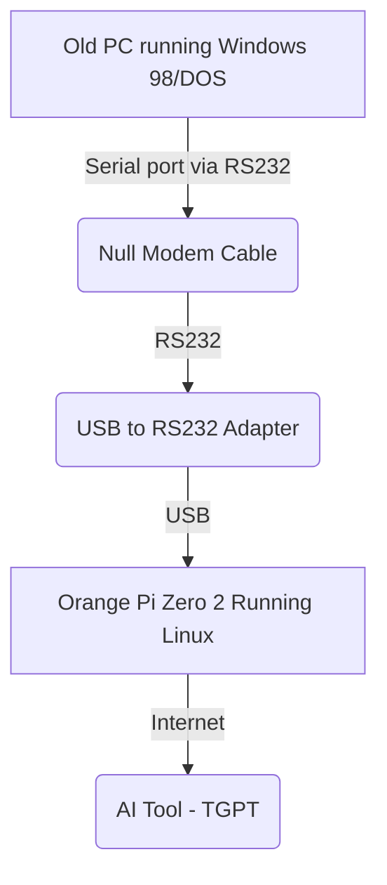

# RetroComputersWithAI
Giving the AI wisdom to retro computers

## Introduction

AI tools provides the users to have super powers in terms of wisdom.
For example, if the user does not know which are the commands to perform a partitioning to a hard disk, the AI can assist the user, provide the correct commands, plus giving explanation about all the involved steps.

The idea is to somehow provide retrocomputers (e.g. MS-DOS, windows 98 PCs) access to a modern AI tools

## Screenshots

## Main concept

It is a fact that retrocomputers have an infinite ammount of impediments to get connected to the modern digital world.

However, a single board computer, even the most simple ones with 1GB of RAM, are able to run linux and do some basic interactions with the modern internet at console level.

The idea is to use a port that can be found in almost every retro computer
as follows:

